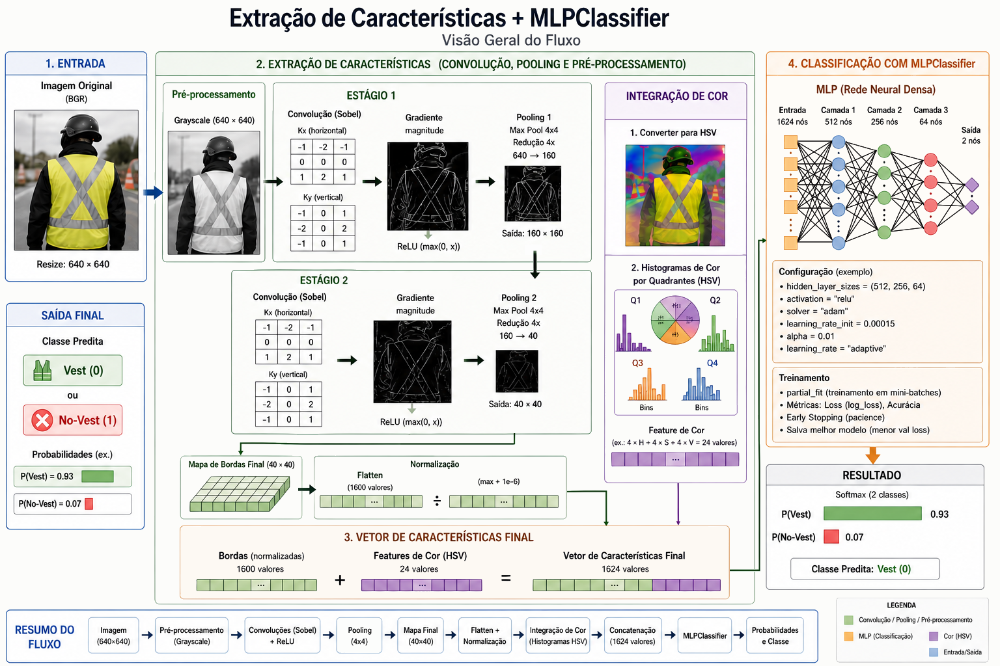
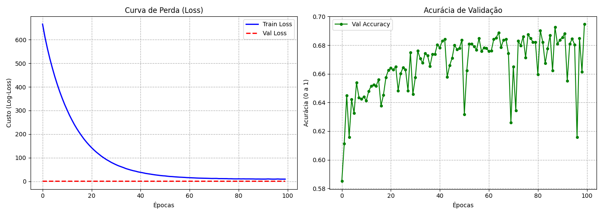
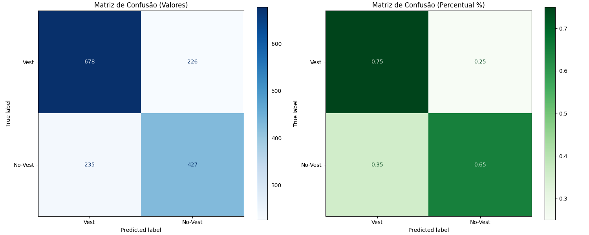
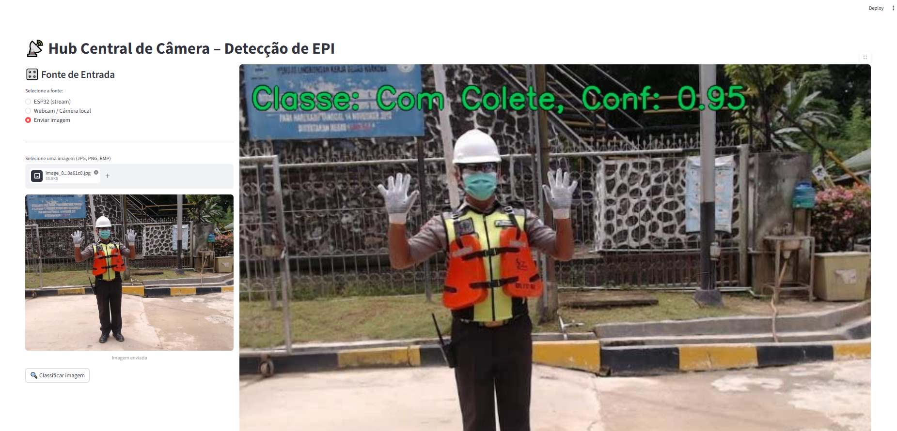
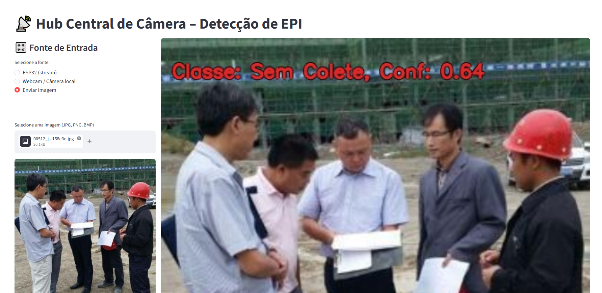

# Verificador de EPI com MLP e Extração de Características Visuais

Sistema de verificação de EPIs (coletes refletivos) baseado em IA, que utiliza uma rede neural MLP simples aliada a um pré-processamento de imagens. As características são extraídas por meio de filtros de borda (Sobel), pooling hierárquico e histogramas de cor com informação espacial. O modelo é treinado com mini-batch gradient descent, proporcionando um bom equilíbrio entre detecção de forma e cor.
# Fluxograma de funcionamento

# Dataset
## Kaggle - Safety Vest Detection Dataset

https://www.kaggle.com/datasets/adilshamim8/safety-vests-detection-dataset

## Balanceamento
O dataset apresenta desbalanceamento entre as classes, com aproximadamente 3 imagens de “Com Colete” para cada 1 imagem de “Sem Colete”. Esse cenário pode levar o modelo a favorecer a classe majoritária, prejudicando a capacidade de generalização.

Para mitigar esse problema, foi aplicada uma técnica de data augmentation na classe minoritária (“Sem Colete”), gerando novas amostras a partir das imagens existentes. As transformações utilizadas incluem ajustes de brilho e inversões, aumentando a diversidade dos dados e contribuindo para um treinamento mais equilibrado.

# Treino

# Matriz de Confusão

# Teste com Interface (Streamlit)
* Teste poder feito com Webcam/Imagens/ESP32Cam(WebServer)

# Tecnologias
* Python
* OpenCV
* Sklearn
* Numpy
* Pandas
* Streamlit

